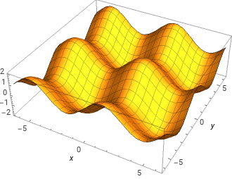
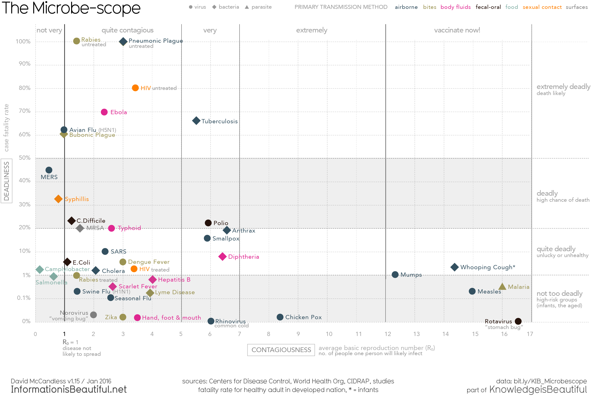

# Libraries

```{r, warning=FALSE, message=FALSE}
library(tidyverse)
library(RColorBrewer)

# data
library(palmerpenguins)

```


## Depicting 3D data using color

* ggplot2 has no built-in support for 3D graphs; instead it emphasizes the use of color, or other aesthetics, to depict more than two dimensions

* Contour plots and heat maps are among the most common ways to generate figures representing 3D data in ggplot


### Contour plots

Contour plots are most useful when you want to represent a variable (say "z") as a function of two other variables (x and y).  Contour plots use nested lines (think contour lines on a topographic map) and optionally color to depict such relationships.

Take for example the mathematical function: $z = \sin(x) + \cos(y)$.  A 3D plot of this function looks like this (generated using Wolfram Alpha):




Below is code to generate the representation of a contour plot for the same function:

```{r}
zfunc <- function(x,y) {
  sin(x) + cos(y)
}
# try some other functions! 
# e.g. z = sin(sqrt(x^2 + y^2))


# create sets of points over which to evaluate zfunc
x <- seq(-2*pi, 2*pi, length = 100)  
y <- seq(-2*pi, 2*pi, length = 100)

# expand grid creates all pairwise combinations of x and y
xy <- expand_grid(x,y)  

xyz <- mutate(xy, z = zfunc(x,y))

ggplot(xyz, aes(x = x, y = y, z = z)) +
  geom_contour() +   
  coord_equal() +
  theme_classic()
```

The contour's are shown above but important information is missing about what regions are "down" versus "up". Here's the same plot enhanced with color to make the changes in the z-axis  more apparent.

```{r}
ggplot(xyz, aes(x = x, y = y, z = z)) +
  geom_contour_filled() + 
  coord_equal() 
```


I think a diverging color scheme makes more sense here, since the data is centered around zero. I like the "RdBu" (red-blue) diverging color scheme for data like this, but reversed (so blue = low, red = high)

```{r}

blue.red.color.scheme <- rev(brewer.pal(9,"RdBu"))

ggplot(xyz, aes(x = x, y = y, z = z)) +
  geom_contour_filled() +   
  # direction = -1 reverse the color scheme direction
  scale_fill_brewer(palette = "RdBu", direction = -1) + 
  coord_equal() 


```

The above plot looks pretty good, but when contours are complicated or numerous the fill colors can get overwhelming.  Another option is to draw simple contours but with the contour lines colored by level:

```{r}
ggplot(xyz, aes(x = x, y = y, z = z)) +
  geom_contour(aes(color = after_stat(level))) +
  scale_color_distiller(palette = "RdBu", direction = -1) + 
  coord_equal() +
  theme_classic()

```

If you want to explicitly label contour lines, see the [metR](https://eliocamp.github.io/metR/index.html) package. 

### Contour plots for depicting bivariate distributions

A useful application of contour plots is to depict bivariate probability distributions, using `geom_density_2d()`

```{r}
ggplot(penguins, aes(x = body_mass_g, y = flipper_length_mm)) +
  geom_point(size=1, alpha = 0.5) +
  geom_density_2d(aes(color = after_stat(level))) + 
  scale_color_distiller(palette = "Reds") 
```


### Heat maps

Heat maps are another way to depict 3D data with color. Typically the x, y axes represent a combination of a categorical variable and a continuous variable. 

`geom_tile` (for small data) and `geom_raster` (for large data) are the standard ggplot2 functions for creating heat maps.

Here we create a heat map showing gene expression over time for about 700 genes that were identified as showing cell cycle oscillatory behavior by Spellman et al. 1998:


First load and filter the data:

```{r, message=FALSE, warning=FALSE}
yeast_long <- read_csv("spellman-long.csv")
cell_cycle <- read_csv("spellman-cell-cycle-list.txt")

# get just the cell cycle genes as given in the cdc28 exptl conditions
cdc28_cell_cycle <-
  yeast_long |>
  filter(gene %in% cell_cycle$Gene) |>
  filter(expt == "cdc28")

# Q: how would you do the first filter step with a join?
# Q: could you combine the two filters above?
```

Then draw the plot:

```{r}
#| fig-width: 4
#| fig-height: 12

# let's try a differen t color scheme
color.scheme <- rev(brewer.pal(9,"PiYG"))

cdc28_cell_cycle |>
  ggplot(aes(x = time, y = gene, fill = expression)) +
  geom_raster(aes(fill = expression)) +  # 
  scale_fill_gradientn(limits=c(-2.5, 2.5), colors=color.scheme)
```


The real power of heat maps becomes apparent when you you rearrange the rows of the heat map to emphasize patterns of interest. For example, let’s recreate that heat map in which we sort genes by the time of their maximal expression. This is one way to identify genes that reach their peak expression at similar times, which is one criteria one might use to identify genes acting in concert.

```{r}
peak.expression <-
  cdc28_cell_cycle |>
  group_by(gene) |>
  summarize(peak = which.max(expression)) |>
  arrange(peak)

```


```{r}
#| fig-width: 6
#| fig-height: 18

# draw from the bottom row up, whereas we want to depict the
# earliest peaking genes at the top of the figure
gene.ordering <- rev(peak.expression$gene)


better_heat <-
  cdc28_cell_cycle |>
  ggplot(aes(x = time, y = gene, fill = expression)) +
  geom_raster(aes(fill = expression)) +  # 
  scale_fill_gradientn(limits=c(-2.5, 2.5), colors=color.scheme) +
  scale_y_discrete(limits=gene.ordering) + 
  labs(x = "Time (mins)", 
       y = "Genes", 
       title = "Cell cycle genes, CDC28 experiment",
       subtitle = "Sorted by time of peak expression") +
  theme(axis.text.y = element_blank(), axis.ticks.y = element_blank())

better_heat
```


```{r}
ggsave("cdc28-heatmap.png", better_heat,  width = 4, height = 12, dpi=600)
```

## Interactive plots


Heatmaps are great, but the exact numbers can be obscured by the color values. We can preserve the big picture visuals of a heatmap and additionally include detailed information by making the plot interactive using the [plotly package](https://plotly.com/ggplot2/).

```{r, warning=FALSE, message=FALSE}
library(plotly)
```


We will make the same heatmap as before, but we will add interactivity through a tooltip window that displays when the cursor is hovered over the heatmap tiles. We need to specify the data and formatting included in our tooltips to pass to plotly later, so we will use mutate to create a new column with that information:


```{r}
genes_peak5 <- peak.expression$gene[peak.expression$peak == 5]

cdc28_peak5 <- 
  cdc28_cell_cycle |>
  filter(gene %in% genes_peak5)

```


```{r}
tooltip_data <- 
  cdc28_peak5 |>
  mutate(tooltip_text = str_c("Gene: ", gene, "\n", 
                              "Time (min): ", time, "\n", 
                              "Expression: ",expression))
```

Now we can add the tooltip_text column as a "text" call in ggplot, and then use the ggplotly wrapper to start the interactive window

```{r}
#| fig-width: 6
#| fig-height: 12

interactive_plot <- 
  ggplot(tooltip_data, 
         aes(x = time, y = gene, 
             fill = expression, text = tooltip_text)) +
    geom_tile() +
    scale_fill_gradientn(limits=c(-2.5, 2.5), colors=color.scheme) +
    theme_bw()
    
ggplotly(interactive_plot, tooltip="text")
```


## Annotations

## ggplot2 extensions

There is an "official" gallery for ggplot2 extensions, which can be found at the following URL: https://exts.ggplot2.tidyverse.org/index.html

We've already used some ggplot2 extensions, such as `patchwork`. Today we'll introduce a few more:

  * ggmagnify -- magnified insets; https://github.com/hughjonesd/ggmagnify
    -- see the instructions at the link above to install ggmagnify

  * ggrepel -- for annotation  / labeling; https://ggrepel.slowkow.com/ -- can be installed via the standard package manager


Install ggmagnify and ggrepel and then load them:

```{r}
library(ggmagnify)
library(ggrepel)
```


### Magnifying regions of a plot

ggmagnify provides a geom for "zooming in" on a region of a plot.  You create your plot using whatever geom(s) are appropriate and then call `geom_magnify` with two vectors specifying the bounds of the plot you want to magnify (`from`) and the region of the plot where you want the mangified image to be drawn (`to`).

```{r, warning=FALSE}

z <- ggplot(penguins, 
       aes(x = flipper_length_mm, 
           y = bill_length_mm,
           color = species,
           shape = sex)) + 
  geom_point(size=2, alpha=0.6) +
  theme_classic() +  # what happens when you move this after coord_cartesian?
  geom_magnify(from = c(190,195,45,50), to = c(220, 235, 25,40)) +
  coord_cartesian(xlim = c(170,240), 
                  ylim = c(20,60)) +
  theme(legend.position = "top") 
  
z
```


### Labeling points

Labeling points with text is another form of annotation.  The function `geom_text` supports basically labeling, but it has some limitations. A ggplot extension package called `ggrepel` extends the functionality of `geom_text`, allowing for nicer automatic labelling of points.

#### Example data: Microbescope

The website [Information is Beautiful](https://informationisbeautiful.net/) has lots of interesting data visualizations and “data stories”. One of the data stories of biomedical interest is the [MicrobeScope](https://informationisbeautiful.net/visualizations/the-microbescope-infectious-diseases-in-context/), which presents data on the contagiousness of various microbes and its relationship to deadliness, fatality rate, media coverage, etc.




I’ve made a cleaned up version of the data used to produce the figure above available to you as a CSV file at the following URL:

  * [microbescope_clean.csv](https://github.com/Bio724D/Bio724D_2024_2025/raw/main/data/microbescope_clean.csv) – this data was derived from the “original data” sheet in the data provided at http://bit.ly/KIB_Microbescope


```{r, warning=FALSE, message=FALSE}
microbescope <- read_csv("microbescope_clean.csv")
```


#### Basic `geom_text` plot

```{r}
#| fig-width: 8
#| fig-height: 6

ggplot(microbescope) + 
  aes(x = average_basic_reproductive_rate,
      y = case_fatality_rate, 
      shape = pathogen_type,
      color = primary_mode_of_transmission) +
  geom_point() + 
  geom_text(aes(label=disease),
            size = 6,
            size.unit = "pt",
            hjust=0, nudge_y = 0.15,
            ) +
  coord_cartesian(xlim = c(0,20))
```

#### Extended version using ggrepel

```{r, warning=FALSE, message=FALSE}
#| fig-width: 15
#| fig-height: 10


my_colors <- c("#335060","#9d9353","#e13698","#37251e",
               "#81aea3","#ff8106","#888888", "firebrick")

microbescope |>
  drop_na() |>
  filter(average_basic_reproductive_rate < 20) |>
  ggplot(aes(x = average_basic_reproductive_rate,
             y = case_fatality_rate, 
             shape = pathogen_type,
             color = primary_mode_of_transmission)) +
  # draw background rectangles
  geom_rect(aes(ymin=0, ymax=1,xmin=-1,xmax=21), 
            alpha=0.003,color='#D3D3D3', linetype="dashed") +
  geom_rect(aes(ymin=20, ymax=50,xmin=-1,xmax=21), 
            alpha=0.003,color='#D3D3D3', linetype="dashed") +  
  # draw points
  geom_point(size=4, alpha=0.6) + 
  scale_color_manual(values = my_colors) +
  # draw labels
  geom_text_repel(aes(label=disease), 
                  size = 4,
                  force = 1,
                  force_pull = 2) +  
  scale_y_sqrt(breaks=c(0,0.1,1,seq(10,100,10)),
               minor_breaks = NULL, 
               sec.axis = dup_axis(name = "",
                                   breaks = c(0.2, 8, 35, 80),
                                   labels = c("Less deadly", "Quite deadly", "Deadly", "Extremely Deadly"))) +

  coord_cartesian(xlim = c(0,20)) +
  labs(x = "Contagiousness: R0",
       y = "Deadliness: Case fatality rate (%)") +
  
  theme_bw() +
  theme(legend.position = "top", legend.background = element_rect(size = 0.5, colour='grey')) +
  guides(color = guide_legend(title = "Primary Mode of Transmission"),
         shape = guide_legend(title = "Pathogen Type")) 

ggsave("microbescope.png", width = 14, height=8)
```


## Misc


### GGally

  * GGally -- ggpairs; https://ggobi.github.io/ggally/articles/ggpairs.html
  
  
The `ggpairs` function from the package GGally is  useful for exploratory data analysis.  It will generate a "matrix" of plots representing the relationships between all pairs of variables in a data frame. It handles continuous and categorical data well. ggpairs works best with a modest number of variables at a time (e.g. <10)


```{r, warning=FALSE, message=FALSE}
#| fig-width: 8
#| fig-height: 8

library(GGally)

ggpairs(penguins)
```


### GT for tables

The [`gt` package](https://gt.rstudio.com/) allows you to make publication-ready tables directly from an R data frame, using the piping and filtering syntax that you are familiar with from dplyr. This circumvents any errors you may get while manually creating a table in another format like excel.

Note that one difference from ggplot is that gt uses pipe calls rather than the `+` operator to add layers.

```{r, warning=FALSE, message=FALSE}
library(gt)
```

```{r}
microbescope |> 
  gt(rowname_col = "disease", groupname_col = "pathogen_type") |> 
  fmt_percent(columns = case_fatality_rate, 
              scale_values = FALSE, 
              drop_trailing_zeros = TRUE) |> 
  fmt_number(columns = average_basic_reproductive_rate, 
             drop_trailing_zeros = TRUE) |> 
  cols_label(
    case_fatality_rate = md("**Fatality Rate**"),
    average_basic_reproductive_rate = md("**R0**"),
    primary_mode_of_transmission ~ md("**Transmission**")) |>
  tab_header(
    title = md("**The MicrobeScope**"),
    subtitle = md("Contagiousness of microbes and pathogens")) |> 
  tab_source_note(
    source_note = md("Reference: https://informationisbeautiful.net/visualizations/the-microbescope-infectious-diseases-in-context/"))|> 
  tab_footnote(
    footnote = "Methicillin-resistant Staphylococcus aureus.",
    locations = cells_stub(rows = "MRSA")) |>
  opt_stylize(style = 6, color = 'gray')
```


