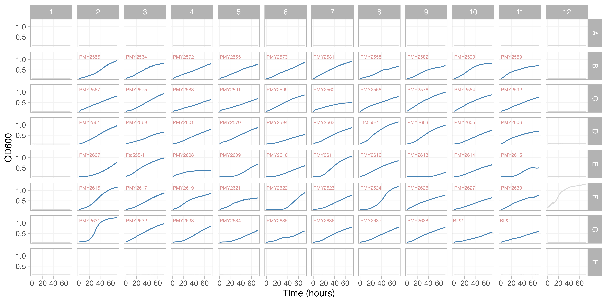
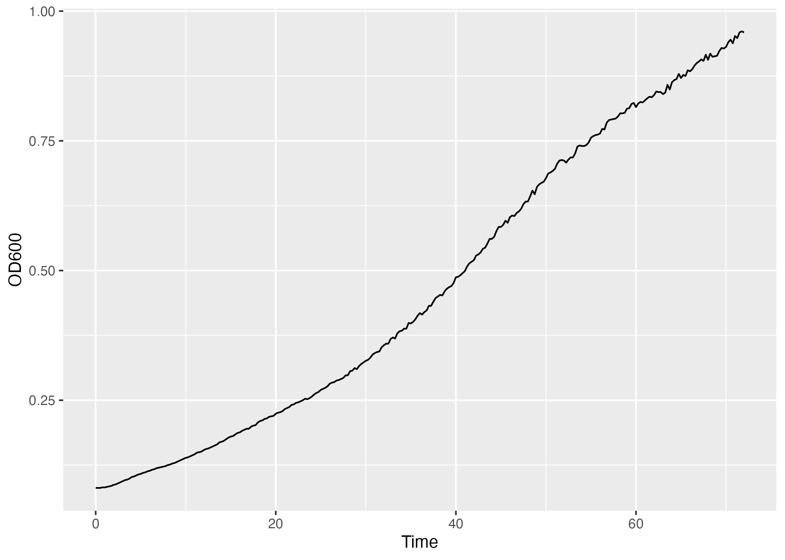
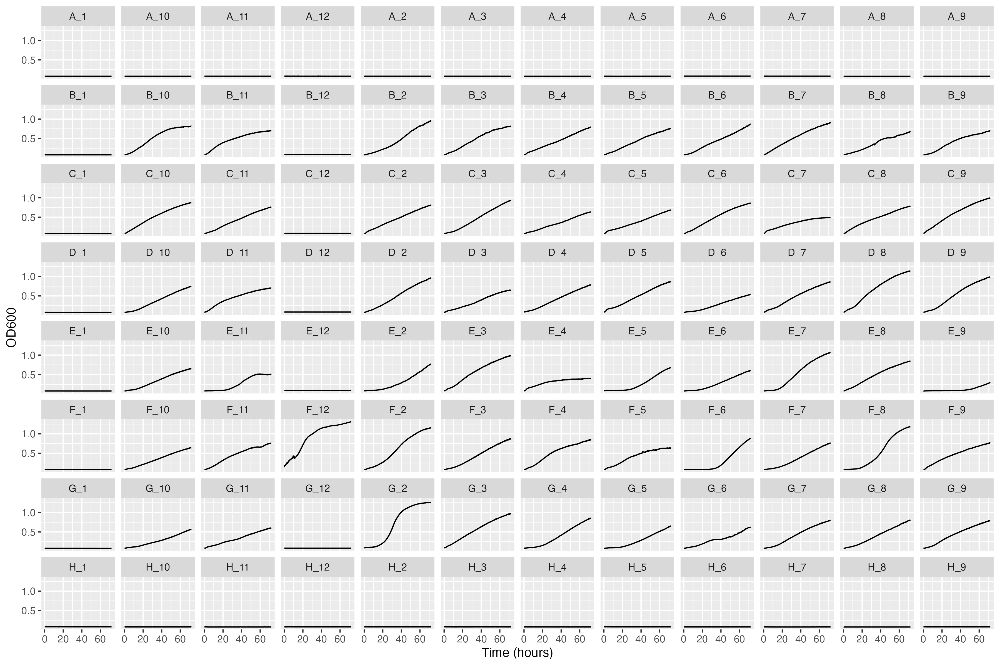
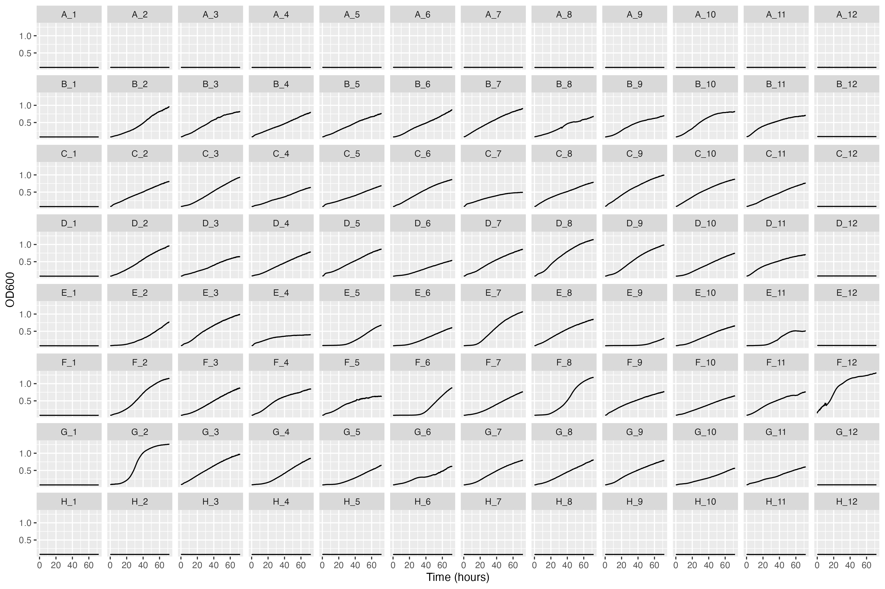
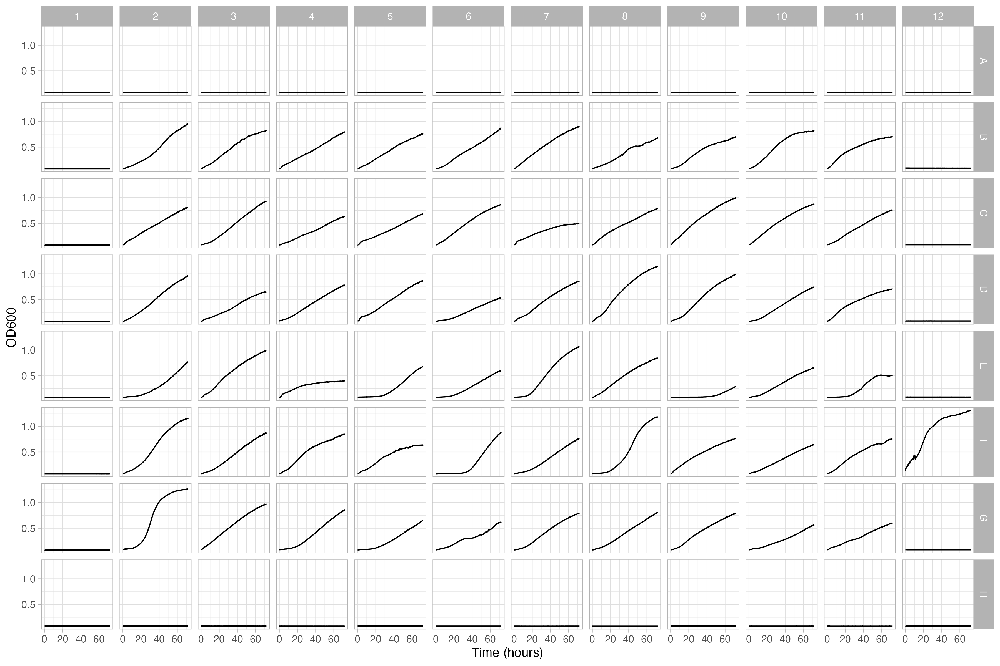

## Libraries

```{r, warning=FALSE, message=FALSE}
library(tidyverse)
```

## Data

```{r}
absorbance_data_URL <-
  "https://github.com/Bio724/Bio724-Example-Data/raw/main/crypto_tecan_run_example.txt"

strain_key_URL <- 
  "https://github.com/Bio724/Bio724-Example-Data/raw/main/crypto_tecan_run_strains.csv"

```

The contents of these two spreadsheets are as follows:

* `crypto_tecan_run_example.txt` -- Absorbance readings (OD600) for a 96-well plate containing strains of the fungal pathogen *Cryptococcus neoformans*. Readings were taken every 15 minutes for 72 hours. Tab-separated values.

* `crypto_tecan_run_strains.csv` -- A key mapping from plate address to yeast strain names (using the systematic naming scheme using for my lab's strain collection). Comma-separated values.

## Goal

The final goal of you analysis is to produce a figure like the following, which shows growth curves for each well in the 96-well plate.  Such figures are useful diagnostics for evaluating these experiments, getting an overview of patterns of growth variation, looking for spatial effects, identifying unexpected results, etc.




## Data complications

A few complications exist with the data.  They include:

* It uses a non-UTF8 encoding called "windows-1252"
* Lack of a header w/column names
* There's any empty last column
* There are two rows of metadata at the end of the file


### Read the data

We explored how to deal with the non-UTF8 encoding in [earlier lecture](https://bio724d.github.io/Bio724D_2025_2026/import_basic_dplyr_template.html#loading-a-file-with-a-non-standard-encoding).


The first two columns hold Time (s) and Temperature (°C) info.  

The subsequent columns are the absorbance readings for each of the 96 wells on the plate. The absorbance value columns are given in the order "A_1, B_1, C_1,...A_2, B_2, C_2,...A_12, B_12, C_12,..." where the letters indicate the row address (see illustrative figure above) and the numbers indicate the column address.

## Challenge 1: Reading the data, renaming, basic cleaning

* Create a data frame from the `crypto_tecan_run_example.txt` file

* Easy: Remove the empty last column and two rows of metadata

* Challenging: Give the columns meaningful names. Since there are 98 columns it would be tedious, error prone, and inefficient to create all of these by hand.   Solve this with computation. The functions `rep` and `str_c` are useful here.
  
Having solved the problem above, your data should look like this:

```
> names(absorbance) |> head()
[1] "time" "temp" "A_1"  "B_1"  "C_1"  "D_1" 

> names(absorbance) |> tail()
[1] "C_12" "D_12" "E_12" "F_12" "G_12" "H_12"

> head(absorbance[1:5])
# A tibble: 6 × 5
  time  temp      A_1   B_1   C_1
  <chr> <chr>   <dbl> <dbl> <dbl>
1 0s    34.9 °C 0.079 0.082 0.08 
2 900s  37.1 °C 0.079 0.082 0.079
3 1800s 36.8 °C 0.079 0.081 0.079
4 2700s 36.8 °C 0.079 0.081 0.079
5 3600s 36.8 °C 0.079 0.081 0.08 
6 4500s 36.8 °C 0.079 0.081 0.079

> tail(absorbance[1:5])
# A tibble: 6 × 5
  time    temp      A_1   B_1   C_1
  <chr>   <chr>   <dbl> <dbl> <dbl>
1 254700s 36.8 °C 0.079 0.081 0.078
2 255600s 36.9 °C 0.079 0.081 0.078
3 256500s 36.8 °C 0.079 0.081 0.078
4 257400s 36.8 °C 0.079 0.081 0.078
5 258300s 36.8 °C 0.079 0.081 0.078
6 259200s 36.8 °C 0.079 0.081 0.078

```
  
  
  
* Create a data frame from the `crypto_tecan_run_strains.csv` file.

  * The row addresses in that file are lower case, make them upper case to match the row address information you created for the tecan run data frame
  
  * Drop the `plate` column (not needed for the current analysis)


## Challenge 2: Structure of your data frame

* What are the dimensions of the absorbance data?

* What are the data types of your absorbance?  How many columns contain numeric data? 


## Challenge 3: Plot a single well


Now that we've wrangled the data into some basic shape we can start to do something useful with it.  The simplest useful step towards our end goal, would be to plot a single growth curve from this experiment.  This is relatively straightforward because we have a data frame with `time` as a variable, and many columns (`A_1`, `A_2`, etc) that contains absorbance readings.

* Unless you wrangled it already, your `time` column is a character type. Convert it to a data type representing time durations using the `lubridate::as.duration` function (see the [lubridate docs](https://lubridate.tidyverse.org/) )

* Create a plot showing absorbance vs time for the well "B_2". When plotting I recommend changing the time (duration) column to a numeric variable using `as.numeric(time, "hours")` which will convert seconds to hours. Your plot should look like the following:




## Challenge 4: Plotting multiple wells in a grid

Our next step is to see if we can generate a plot:


* Create a "long" version of your absorbance data frame, that has the following form:

```
  time       temp    address absorbance
  <Duration> <chr>   <chr>        <dbl>
1 0s         34.9 °C A_1          0.079
2 0s         34.9 °C B_1          0.082
3 0s         34.9 °C C_1          0.08 
4 0s         34.9 °C D_1          0.08 
5 0s         34.9 °C E_1          0.079
6 0s         34.9 °C F_1          0.079
  ... <more output> ...
```


* Using the long version of your data see if you can create the following plot:




## Challenge 5: Fixing the plot order


Note that the plots in the figure above are not shown in the order expected. For example the first row is "A_1", "A_10", "A_11", etc.  Why is this?  It turns out that R is sorting our address variable in "string order" rather than numeric order.  We can deal with this by transforming our address variable to a factor rather than string. For our purposes the function `forcats::as_factor()` is the best way to do this (forcats is another tidyverse package)


* Convert the `address` column to a factor using `forcats::as_factor()` and generate the figure below which. Hint: checkout the `dir` argument to `facet_wrap` to change the order in which the faceted plots are drawn.




## Plotting multiple wells in a grid, part II

The `facet_wrap()` approach above works alright but I'm not crazy about the facet labels above each plot.  In addition the single `address` column confounds two pieces of information -- the row and column where each well is located.  If one were analyzing an experiment for unwanted spatial effects both of these pieces of information would be important.


* To solve this issues we're going to make our "long" data frame a little wider by splitting up the address variable into two separate columns, `row_address` and `column_address`. Use the tidyr function `tidyr::separate_wider_delim()` to do this.


* Now that we have two address variables we can employ `facet_grid()` rather than `facet_wrap()` to generate the plot. See if you can generate the following. Note I used `theme_light()` to reduce the visual clutter in the outoput.



## Challenge 6: Adding Strain Information

We've wrangled our data set into a form that's easy to work with. However, we're not done yet as there's important metadata about the strains that we need to add to our plot to make sense of the information we're looking at. 

* Join the absorbance data and strain data appropriately so that you have a combined data frame that maps addresses to strain names

* See if you can generate the plot below (or at least something that approximates it). `geom_text` is useful for adding labels:


