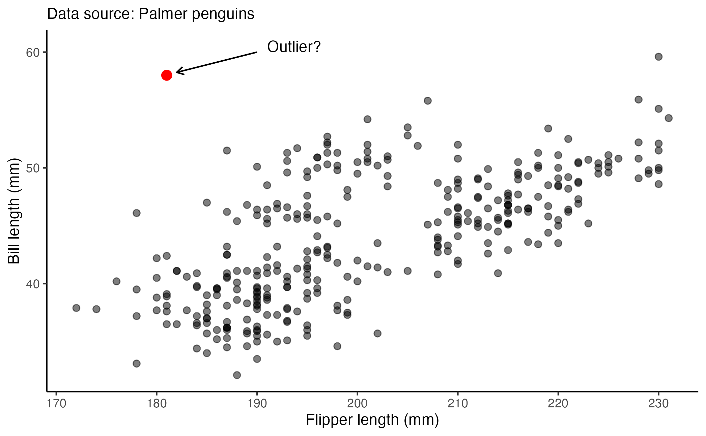
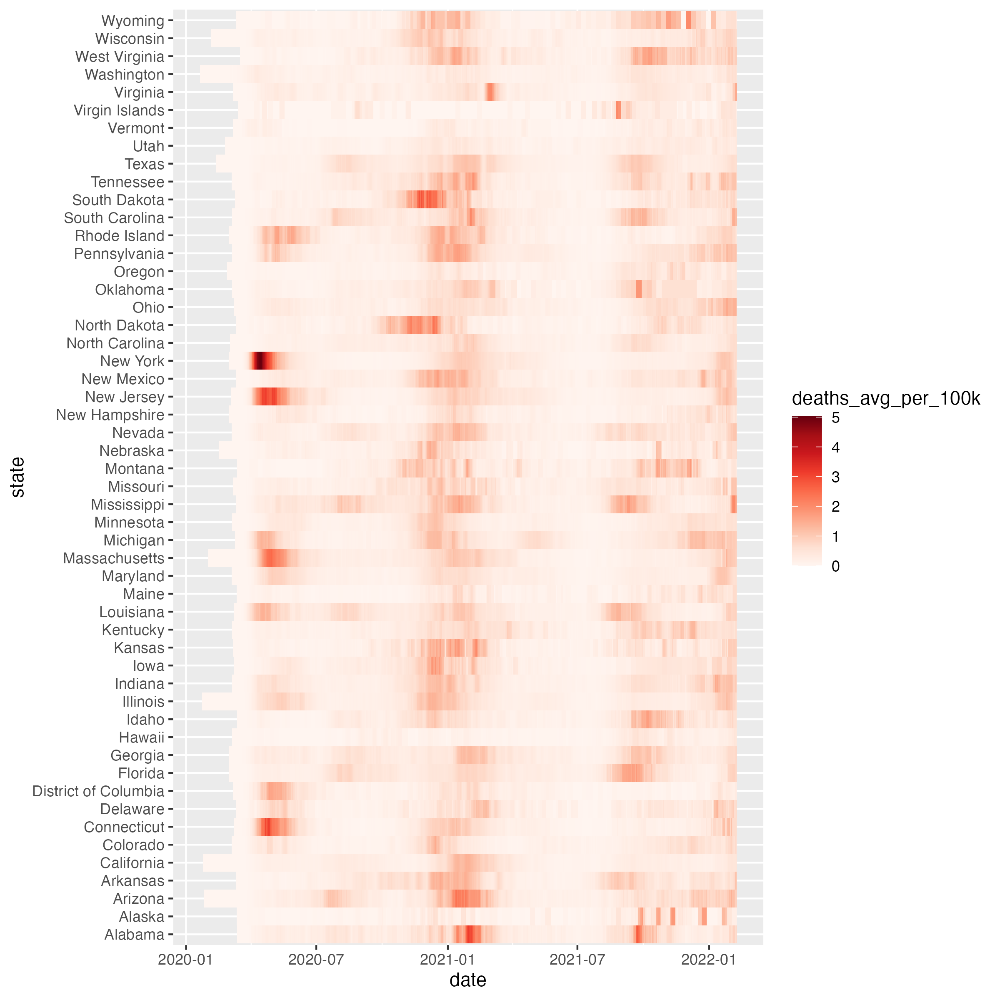

# Instructions

Create a Quarto markdown document and answer the questions below using code blocks that generate the correct outputs. We encourage you to include explanatory text in your markdown document, however **each of your solutions should show how to generate the answer using R code**.

Write "robust" solutions wherever possible. A good rule of thumb for judging whether your solution is appropriately "robust" is to ask yourself "If I added additional observations or variables to this data set, or if the order of variables changed, would my code still compute the right solution?"

Make sure your markdown is nicely formatted -- use headers, bullets, numbering, etc so that the structure of the document is clear.

Make sure to "Render" your document before submission to confirm that all code blocks and formatting is as you expect.

When completed, title your markdown file as follows (replace `XX` with the assignment number, e.g. `01`, `02`, etc):

-   `netid-assignment_XX.qmd`

Submit both your markdown file (`.qmd`) and the generated HTML document (`.html`) on your Github site.

### Problems

1. Locate a graphic in a publication that you think does *not* represent graphical excellence. Provide the reference and figure number. Download or grab a screenshot of the graphic and insert it into your homework notebook. Explain what is not great about the graphic and what you think could be done better. 

2. Using the `penguins` data from `palmerpenguins`, re-create the following plot with the included annotation elements:

    
3. Using the data below, create a heatmap depicting covid deaths on average per 100K people, over time for US states. Filter out non-states (e.g. territories, protectorates) except for the District of Columbia.Make sure to use an appropriate color scale for the type of data depicted.

* [nytimes-covid-data-us-states_2022-02.csv](https://github.com/Bio724D/Bio724D_2024_2025/raw/main/data/nytimes-covid-data-us-states_2022-02.csv) -- Data on COVID cases and deaths, by state, from 2020 to 2022, compiled by the NY Times.

Your figure should look something like this:   

## Data lunch assignment

Identify something that you learned from the presentation or discussion on Thursday that you found valuable. Provide a brief reflection here (1-5 sentences) and include code or pseudo-code if useful. Hint: if you have specific code examples, consider adding them to your notebook as well.

