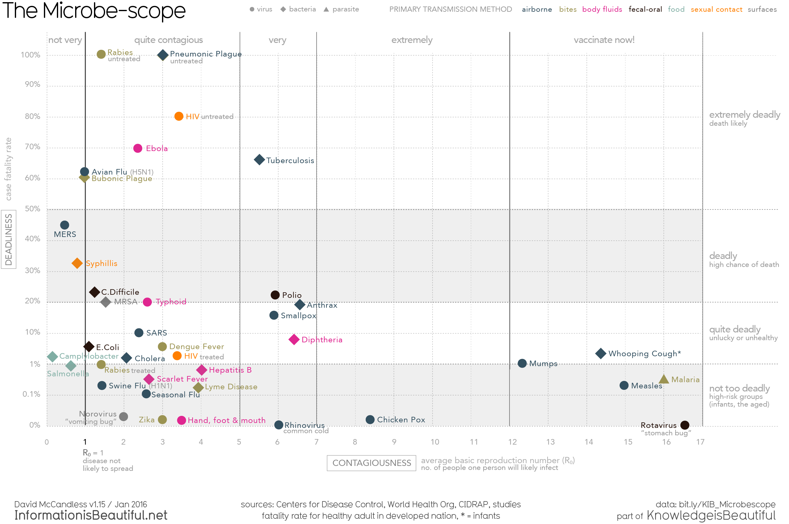

# Instructions

Create a Quarto markdown document and answer the questions below using code blocks that generate the correct outputs. We encourage you to include explanatory text in your markdown document, however **each of your solutions should show how to generate the answer using R code**.

Write "robust" solutions wherever possible. A good rule of thumb for judging whether your solution is appropriately "robust" is to ask yourself "If I added additional observations or variables to this data set, or if the order of variables changed, would my code still compute the right solution?"

Make sure your markdown is nicely formatted -- use headers, bullets, numbering, etc so that the structure of the document is clear.

Make sure to "Render" your document before submission to confirm that all code blocks and formatting is as you expect.

When completed, title your markdown file as follows (replace `XX` with the assignment number, e.g. `01`, `02`, etc):

-   `netid-assignment_XX.qmd`

Submit both your markdown file (`.qmd`) and the generated HTML document (`.html`) on your Github site.

# Data

The website ["Information is Beautiful"](https://informationisbeautiful.net/) has lots of interesting data visualizations and "data stories".

One of the data stories of biomedical interest is the [MicrobeScope](https://informationisbeautiful.net/visualizations/the-microbescope-infectious-diseases-in-context/), which presents data on the contagiousness of various microbes and its relationship to deadliness, fatality rate, media coverage, etc.

The following image shows the relationship between contagiousness ($R_0$) and deadliness (case fatality rate).

---

{#fig-microbescope fig-align="center"}

---

I've made the original data used to produce the figure above available to you as a CSV file at the following URL:

* [Microbescope_original_data.csv](https://github.com/Bio724/Bio724-Example-Data/raw/main/Microbescope_original_data.csv) -- this data was derived from the "original data" sheet in the data provided at http://bit.ly/KIB_Microbescope

# Problems

1. Demonstrate how to wrangle the `Microscope_original_data.csv` in a "tidy" form, to match the "clean" version of the data shown at [`microbescope_clean.csv`](https://raw.githubusercontent.com/Bio724D/Bio724D_2025_2026/main/data/microbescope_clean.csv)

2. If you wrangled your data correctly, you should be able to reproduce the Microbescope plot [using the code from last week's class](https://bio724d.github.io/Bio724D_2025_2026/06_more_ggplot2_kw_complete.html#extended-version-using-ggrepel).  Demonstrate this here. 
