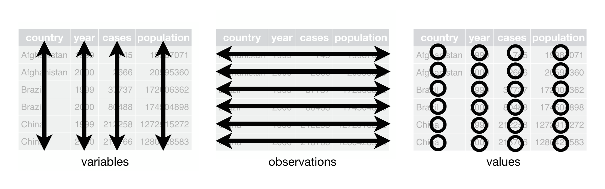
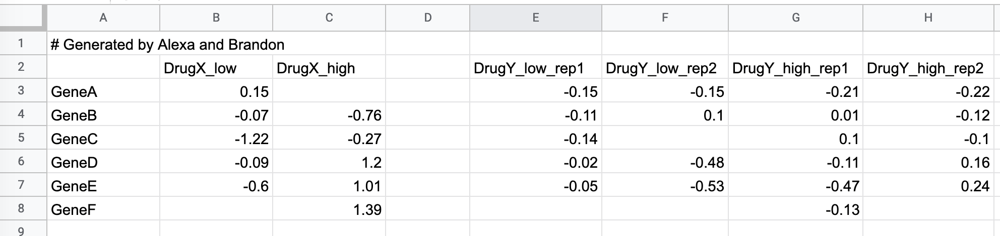

```{r setup, include=FALSE}
knitr::opts_chunk$set(echo = TRUE, 
                      warning=FALSE, 
                      message=FALSE, 
                      comment = "", 
                      collapse = TRUE)
options(width=70)
```

```{r, echo=FALSE}
library(tidyverse)
library(kableExtra)

kable_print <- function(df, fntsize=5) {
  knitr::kable(df, format = "latex", booktabs = TRUE, linesep = "") |>
  kable_styling(latex_options = "striped", font_size = fntsize)  
}
```

## Real-world data is often messy

Data files you generate or will be given may...

-   Be poorly organized
-   Have missing values
-   Contain extraneous information
-   Lack headers (variable names)
-   Confound variables and labels
-   Use different encoding schemes
-   Use unfamiliar conventions for dates, decimal separators, etc.
-   Include empty columns -- used for visual organization in spreadsheet, but interferes with analysis
-   Include meta data and comments

## Tidy data

To facilitate downstream analyses, data should be organized in a manner such that...

1.  Each variable must have its own column.
2.  Each observation must have its own row.
3.  Each value must have its own cell.




## `dplyr` and `tidyr` to the rescue

The tidyverse packages `dplyr` and `tidyr` provide many useful tools for wrangling data into a tidy form.

#### dplyr functions that facilitate wrangling

-   `select`
-   `filter`
-   `mutate`
-   `rename`
-   `arrange`
-   `left_join`
-   `full_join`
-   `inner_join`


#### key functions introduced by tidyr

-   `pivot_longer` - reshape column data into rows
-   `pivot_wider` - reshape row data into columns
-   `separate_wider_delim`, `separate_wider_position`, `separate_wider_regex` - turns a single column into multiple columns
-   `unite` - turns multiple columns in a single column


## Example: Starting messy data

\footnotesize
```
# Generated by Alexa and Brandon
,DrugX_low,DrugX_high,,DrugY_low_rep1,DrugY_low_rep2,DrugY_high_rep1,DrugY_high_rep2
GeneA,0.15,,,-0.15,-0.15,-0.21,-0.22
GeneB,-0.07,-0.76,,-0.11,0.1,0.01,-0.12
GeneC,-1.22,-0.27,,-0.14,,0.1,-0.1
GeneD,-0.09,1.2,,-0.02,-0.48,-0.11,0.16
GeneE,-0.6,1.01,,-0.05,-0.53,-0.47,0.24
GeneF,,1.39,,,,-0.13,
```
\normalsize

\bigskip

{width=95%}


## Naively reading the data produces poor results


```{r}
messy <- read_csv("~/Downloads/small-messy-data.csv")
```

```{r,echo=FALSE}
kable_print(messy)
```


## Explore options of your reader function(s)

### Example: filtering comment lines

```{r}
messy <- read_csv("~/Downloads/small-messy-data.csv", comment="#")
```

```{r,echo=FALSE}
kable_print(messy)
```


## Renaming columns using dplyr::rename

```{r}
messy <- 
  messy |>
  rename(Gene = "...1")
```

```{r,echo=FALSE}
kable_print(messy)
```


## Dropping columns using select

```{r, results='hide'}
messy |>
  select(-"...4")
```

```{r,echo=FALSE}
messy |>
  select(-"...4") |>
  kable_print()
```


## Dropping columns using select and where

If you had many columns it might not be feasible to specify the names directly. The `where` helper function can be used to specify a function to determine column selection.

```{r}
messy <-
  messy |>
  select(-where( function(x) all(is.na(x)) ))
```

```{r,echo=FALSE}
kable_print(messy)
```

## Reshaping a data frame using pivoting

`tidyr::pivot_longer` collapses multiple columns into a single column, and create a new column from the collapse columns headers:

\bigskip

```{r, results='hide'}
long_messy <-
  messy |>
  pivot_longer(cols = -Gene, 
               names_to="Drug_Dosage_Rep", 
               values_to="Expression")
```

```{r,echo=FALSE}
kable_print(long_messy[1:10,], fntsize = 8)
```


## Extract a column in multiple columns

`tidyr::separate_wider_delim` splits a single column into multiple columns based on a character delimiter.

\bigskip

```{r, results='hide'}
split_long_messy <-
  long_messy |>
  separate_wider_delim(cols = Drug_Dosage_Rep, 
                       delim = "_",
                       names = c("Drug", "Dosage", "Replicate"),
                       too_few = "align_start")
```

```{r,echo=FALSE}
kable_print(split_long_messy[1:10,], fntsize = 8)
```

## Filling missing data 

`tidyr::replace_na` can be used to replace `NA` values with a default:

\bigskip

```{r}
tidy_data <-
  split_long_messy |>
  replace_na(list(Replicate = "rep1"))
```

```{r,echo=FALSE}
kable_print(tidy_data[1:10,], fntsize = 8) 
```


## Tidy data enables complex summaries

```{r, results='hide'}
tidy_summary <-
  tidy_data |>
  group_by(Gene, Drug, Dosage) |>
  summarize(Mean_Expression = mean(Expression, na.rm=TRUE))

```

\bigskip

```{r,echo=FALSE}
kable_print(tidy_summary[1:10,], fntsize=8)
```


## Tidy data enables complex plotting 

```{r, out.width="80%", fig.align='center'}
tidy_summary |>
  ggplot(aes(x = Dosage, y = Mean_Expression, color=Drug)) + 
  geom_point(alpha=0.85, size = 3) + 
  geom_line(aes(group=Drug)) +
  facet_wrap(~Gene)
```


## Summary and raw values as different ggplot layers

\footnotesize
```{r, out.width="70%", fig.align='center'}
tidy_summary |>
  ggplot(aes(x = Dosage, y = Mean_Expression, color=Drug)) + 
  geom_point(alpha=0.85, size=3) + 
  geom_line(aes(group=Drug)) +
  geom_point(data=tidy_data, 
             mapping=aes(x = Dosage, y = Expression, color=Drug),
             alpha = 0.5, size = 1.5, 
             inherit.aes = FALSE) + 
  facet_wrap(~Gene)
```


## Widening

`tidyr::pivot_wider` creates new columns and headers from specified columns:

\bigskip    

\small
```{r, results='hide'}
tidy_wide <- 
  tidy_summary |>
  pivot_wider(names_from = Gene, values_from = Mean_Expression)
```

```{r,echo=FALSE}
kable_print(tidy_wide)
```

\bigskip

```{r, results='hide'}
corr_from_wide <- 
  tidy_summary |>
  ungroup() |>  # ungroup important here
  pivot_wider(names_from = Gene, values_from = Mean_Expression) |>
  select(-c(Drug,Dosage,GeneF)) |>
  cor(use = "pairwise.complete.obs" )
```
 
```{r,echo=FALSE}
kable_print(corr_from_wide)
``` 
